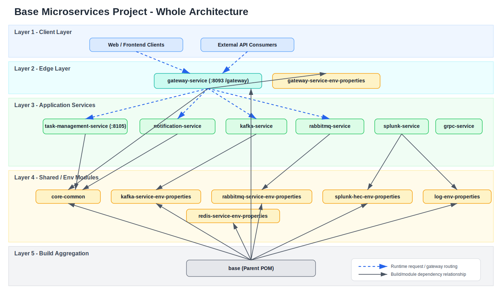

# Nano tech Microservices Project

This repository is a multi-module Spring Boot workspace built around a gateway-based microservices architecture.
It includes shared support modules, environment-specific configuration modules, and backend services such as the task management service.

## Project Structure

### Main Modules
- `gateway-service` - API gateway and request routing entry point
- `gateway-service-env-properties` - gateway profile-based configuration (`dev`, `staging`, `prod`, `test`)
- `task-management-service` - authentication, user management, task workflow, and comments

### Supporting Modules
- `core-common`
- `notification-service`
- `kafka-service`
- `kafka-service-env-properties`
- `rabbitmq-service`
- `rabbitmq-service-env-properties`
- `splunk-service`
- `splunk-hec-env-properties`
- `redis-service-env-properties`
- `log-env-properties`
- `grpc-service`

## Architecture Diagram



The diagram above shows layered architecture, runtime request routing, and build/module dependency relationships.

## Setup Instructions

### Prerequisites
- Java 21
- Maven 3.9+ (or the Maven Wrapper if available)
- Git
- H2 database for local development and testing
- Kafka
- RabbitMQ
- Redis
- Splunk

### Build the Full Workspace
From the repository root:

```powershell
mvn clean install
```

### Run the Gateway Service
```powershell
mvn -pl gateway-service spring-boot:run
```

### Run the Task Management Service
```powershell
mvn -pl task-management-service spring-boot:run
```

### Select a Profile
The gateway reads environment-specific configuration from the `gateway-service-env-properties` module.

#### PowerShell
```powershell
$env:SPRING_PROFILES_ACTIVE = "dev"
```

#### Command Line
```powershell
java -jar gateway-service.jar --spring.profiles.active=prod
```

### Common Local URLs
- Gateway: `http://localhost:8093/gateway`
- Task Management Service: `http://localhost:8105`
- Swagger UI: `http://localhost:8105/swagger-ui.html`
- OpenAPI JSON: `http://localhost:8105/v3/api-docs`
- H2 Console: `http://localhost:8105/h2-console`

## Architecture Explanation

### High-Level Design
The project uses a gateway-fronted microservices architecture.

1. Clients send requests to the gateway service.
2. The gateway routes requests to the correct backend service.
3. Backend services implement the business logic.
4. The task management service exposes secured APIs for authentication, users, and tasks.
5. Database state is managed through SQL migrations and JPA entities.

### Gateway Architecture
In the development profile, the gateway runs on:
- Port: `8093`
- Context path: `/gateway`

It also imports optional shared configuration files for logging, Redis, Kafka, RabbitMQ, and Splunk.

#### Gateway Routes in Dev
- `/api/notifications/**` → `http://localhost:8100`
- `/api/kafka/**` → `http://localhost:8097`
- `/api/rabbitmq/**` → `http://localhost:8098`
- `/api/tasks/**` → `http://localhost:8105`
- `/config/**` → `http://localhost:8092`
- `/api/task-auth/**` → rewritten to `/api/auth/**`
- `/api/task-users/**` → rewritten to `/api/users/**`

#### Gateway Features
- JWT resource server security
- Global CORS configuration
- Resilience4j circuit breakers and time limiters
- API key support
- Rate limiting
- Optional IP filtering
- Optional Redis and service logging integration

### Task Management Service Architecture
The task management service runs on port `8105` and provides:
- `POST /api/auth/register`
- `POST /api/auth/login`
- `GET /api/users/me`
- `GET /api/users`
- `POST /api/users`
- `PATCH /api/users/{id}/status`
- `POST /api/tasks`
- `GET /api/tasks`
- `GET /api/tasks/{id}`
- `PUT /api/tasks/{id}`
- `PATCH /api/tasks/{id}/status`
- `DELETE /api/tasks/{id}`
- `POST /api/tasks/{id}/comments`
- `GET /api/tasks/{id}/comments`

It supports:
- JWT authentication
- role-based access control with `ROLE_USER` and `ROLE_ADMIN`
- task lifecycle management
- soft delete for tasks
- audit tracking through created/updated fields
- Swagger/OpenAPI documentation

## API Documentation

See [`docs/api-documentation.md`](docs/api-documentation.md) for the full Swagger/OpenAPI overview, endpoint groups, security details, and gateway route mappings.

## Database ERD/SQL

See [`docs/database-erd-sql.md`](docs/database-erd-sql.md) for the full ERD summary, SQL schema, relationships, indexes, and seed data.

## Notes
- The root build is configured for Java 21.
- Swagger/OpenAPI is available for the task management service.
- Profile-based configuration keeps environment settings separate from application code.
- The gateway is the primary entry point for client traffic in this workspace.
- Detailed documentation now lives under `docs/`.

